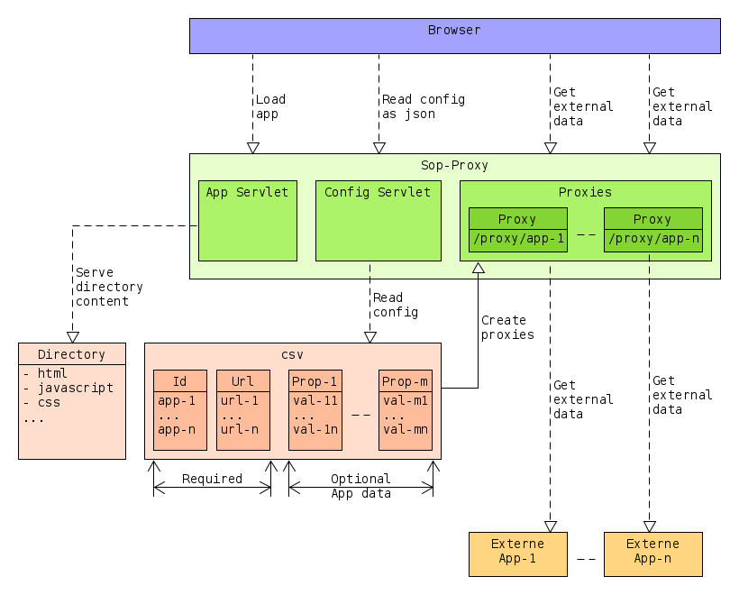

# Sop-Proxy

The Sop-Proxy is a program that allows a javascript application to access data 
on different servers. It is an easy to use proxy that addresses the restrictions 
of the [same-origin-policy](https://en.wikipedia.org/wiki/Same-origin_policy).

The application is started with a csv file, which contains definitions of the
remote targets, that should be reached. Each target has at least an id and an
url and for each target a proxy servlet is created with the id as part of the
context path.

Additionally the Sop-Proxy has a servlet the serves the content of a configured
directory. The directory contains the javascript application (html, css, 
javascript, ...).

The last part of the Sop-Proxy is a config servlet, which provides a simple REST
api for the configured proxies.



# Example

The following example illustrates the usage of the sop-proxy. The proxy is 
provided as an executable jar file and is called with a properties file.

```bash
java -jar sop-proxy-exec-0.1.jar <properties-file>
```

You can get a template of the properties file by calling:

```bash
java -jar sop-proxy-exec-0.1.jar template > sop-pproxy.props
```

At least the following parameters have to be set in the properties file.

```
csv.file=<csv-file>

app.path=<directory with the app (html, javascript, css, ..)>
```

## CSV File
We create a csv file with the proxy configurations. It contains the required id 
and url for each proxy and additionally a name to display in the javascript 
application.

```csv
id,url,name
weather,https://www.weatherapi.com/docs/,Weather
books,https://www.googleapis.com/books/v1/,Books
```

For each entry in the csv file, a proxy servlet is created. If the sop-proxy 
runs on `localhost:8080`, then the incoming requests are mapped in the following 
manner.

|Lokal URL|Remote URL|
|---|---|
|http://localhost:8080/proxy/weather/weather_conditions.json|https://www.weatherapi.com/docs/weather_conditions.json|
|http://localhost:8080/proxy/books/volumes?q=isbn:1492037257|https://www.googleapis.com/books/v1/volumes?q=isbn:1492037257|

## Remote URL's
For the following example we are using these two urls, which return json data:

- https://www.weatherapi.com/docs/weather_conditions.json
- https://www.googleapis.com/books/v1/volumes?q=isbn:1492037257

Both urls are using ssl, so we need to create a trust store with their 
certificates. Download the certificates and import them to a trust store with 
the following commands:

```
keytool -import -file google-books.pem -alias google-books -keystore trust-store -storepass changeit
keytool -import -file weatherapi.pem -alias weatherapi -keystore trust-store -storepass changeit
```

## Application

With the preparations done, you can write an application, that lists, for 
example informations about a book, that was requested from google with the uri:

    /proxy/books/volumes?q=isbn:1492037257

```html
<script src="https://ajax.googleapis.com/ajax/libs/jquery/3.4.1/jquery.min.js"></script>
<script>
  $(document).ready(function() {
  
    $.get("/proxy/books/volumes?q=isbn:1492037257", function(data, status){
      var book = $('#book');
      book.append('<tr><td>ISBN</td><td>1492037257</td></tr>');
      book.append('<tr><td>Title</td><td>'+data.items[0].volumeInfo.title+'</td></tr>');
      book.append('<tr><td>Subtitle</td><td>'+data.items[0].volumeInfo.subtitle+'</td></tr>');
    });
  });
</script>

...

<h2>Book</h2>
<table id="book">
  <tr> <th>Name</th> <th>Value</th> </tr>
</table>
```


## Config Servlet

You can get a list of all proxy configurations with the following command:

http://localhost:8080/config/list

```json
[
  {
    "id": "books",
    "url": "https://www.googleapis.com/books/v1/",
    "data": {
        "name": "Books"
    }
  },
  {
    "id": "weather",
    "url": "https://www.weatherapi.com/docs/",
    "data": {
        "name": "Weather"
    }
  }
]
```

It is also possible to access an individual proxy configuration with the
id of the proxy:

http://localhost:8080/config/get/<id>

```json
{
  "id": "books",
  "url": "https://www.googleapis.com/books/v1/",
  "data": {
      "name": "Books"
  }
}
```

